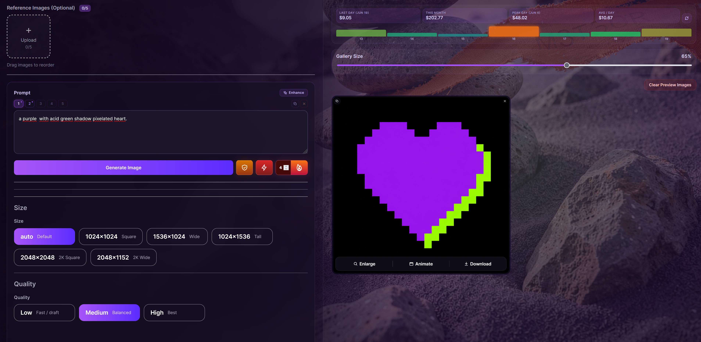

# AI Image UI GPT-2 Native

Local Vue + Express app for generating, editing, inpainting, outpainting, and animating images. Uses OpenAI gpt-image-1 for image generation and fal.ai xai/grok-imagine-video for image-to-video animation. The frontend manages prompts, reference images, masks, a job gallery, and a usage/cost stats dashboard; the backend handles uploads, generation, crop-stitch inpainting, background jobs, and runtime file storage.



## Setup

Install dependencies:

```bash
npm install
```

Create a local environment file:

```bash
copy .env.example .env
```

Then edit `.env` and set:

```bash
OPENAI_API_KEY=sk-your-api-key-here
```

Optional values:

```bash
OPENAI_IMAGE_MODEL=gpt-image-2
PORT=5010
```

For the usage/cost stats dashboard, also set an Admin key (create one at platform.openai.com/settings/organization/admin-keys):

```bash
OPENAI_ADMIN_KEY=sk-admin-your-admin-key-here
```

For image-to-video animation via fal.ai, set a fal.ai API key (get one at fal.ai/dashboard/keys):

```bash
FAL_KEY=your-fal-api-key-here
```

## Startup Commands

Run the frontend and backend together:

```bash
npm run dev
```

Frontend only:

```bash
npm run vite
```

The Vite app runs on:

```text
http://localhost:5174
```

Backend only:

```bash
npm run server
```

The Express server runs on:

```text
http://localhost:5010
```

## Prompt Enhancer (Ollama)

The **Enhance** button next to the prompt textarea (and inside the Animate modal) sends your rough idea to a local [Ollama](https://ollama.com) instance and returns a detailed, camera-aware image prompt.

### Requirements

- Ollama installed and running locally
- The target model pulled: `ollama pull gemma4:31B`

### Configuration

All Ollama settings are optional — the defaults work out of the box with a local Ollama server:

```bash
OLLAMA_URL=http://localhost:11434   # Ollama base URL
OLLAMA_MODEL=gemma4:31B            # Model to use
OLLAMA_NUM_CTX=8192                # Context window in tokens
OLLAMA_SYSTEM_PROMPT=              # Leave blank to use the built-in artist system prompt
```

For a hosted deployment, point `OLLAMA_URL` at your remote Ollama server.

## Tests

Run the server-side test suite once:

```bash
npm test
```

Watch mode (re-runs on file changes):

```bash
npm run test:watch
```

Tests live under `server/__tests__/` and use [Vitest](https://vitest.dev/) with [supertest](https://github.com/ladjs/supertest). All external dependencies (OpenAI, fal.ai, sharp, fs) are mocked — no real API calls or disk access occur.

## Runtime Folders

Generated and uploaded image files are stored locally in ignored runtime folders:

```text
input/
output/
mask/
crop-stitch/
uploads/
```
